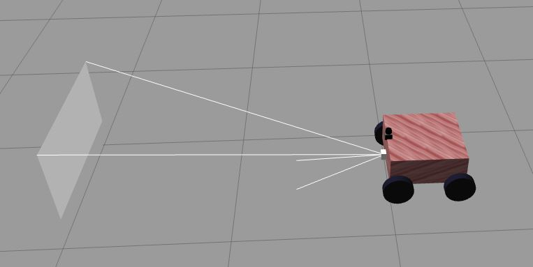
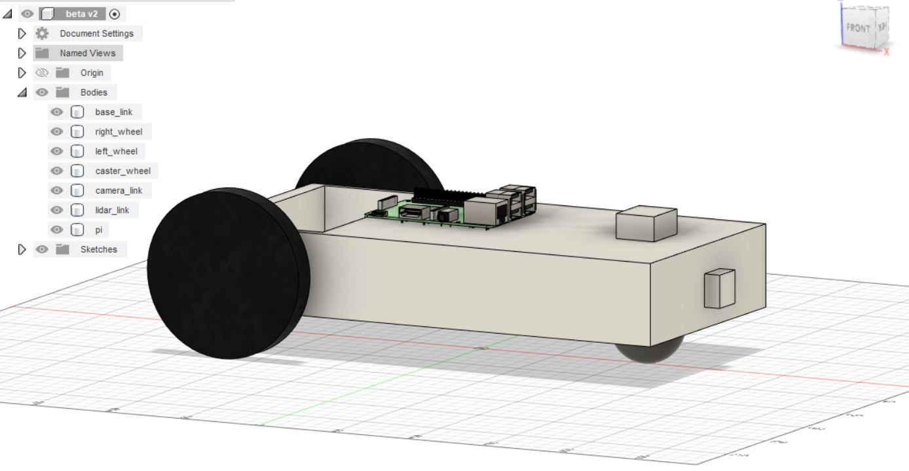
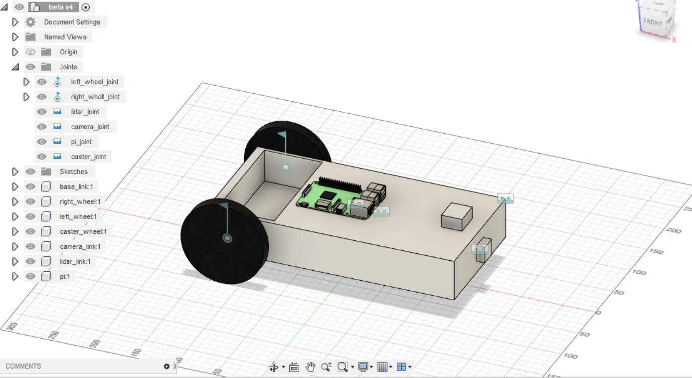
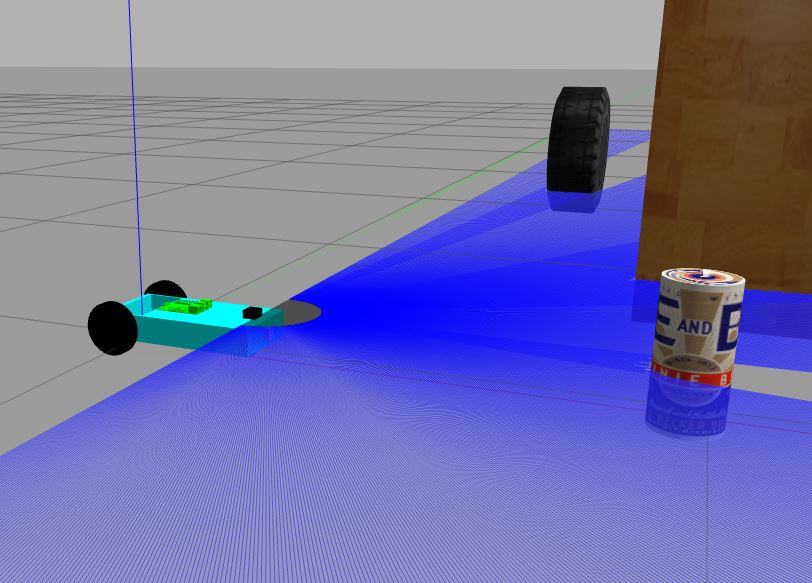

## ROS
The Robot Operating System (ROS) is a set of software libraries and tools that help you build robot applications. From drivers to state-of-the-art algorithms, and with powerful developer tools, ROS has what you need for your next robotics project. And it's all open source. Follow: http://wiki.ros.org/ROS/Installation

This repository includes sample codes to create your own robot using ROS.

## Contents

- [Prerequisites](#prerequisites)
- [Set Up](#set-up-workspace)
- [Atom Bot](#atom-robot)
- [Atom SDF](#atom-robot-sdf)
- [Beta Bot](#beta-robot)
- [Control Bots](#control-the-bot)
- [Autonomous Navigation](./Navigation.md)

## Prerequisites

Replace <version> with noetic, melodic etc.
  
- ROS (`$ sudo apt-get install ros-<version>-desktop-full`)
- Xacro (`$ sudo apt-get install ros-<version>-xacro`)
- Gazebo (`$ sudo apt-get install ros-<version>-gazebo-ros`)

## Set up workspace


```bash
git clone https://github.com/harshmittal2210/Robotics_ws/
cd Robotics_ws
git submodule update --init --recursive
catkin_make
source devel/setup.sh
```

`Note: Do not add Robotics_ws in your catkin_ws/src`

I am just using the folder name `Robotics_ws` instead of `catkin_ws`

## Atom Robot

```bash
roslaunch atom world.launch
```
<p align="center">

  </p>

## Atom Robot (SDF)

```bash
roslaunch atom gazebo_world.launch
```
<p align="center">

  </p>
  
## Beta Robot

```bash
roslaunch beta_description gazebo.launch
```
  <p align="center">
    
    
    
  </p>

## Control the bot

Use `teleop_twist_keyboard`

```bash
rosrun teleop_twist_keyboard teleop_twist_keyboard.py cmd_vel:=/atom/cmd_vel
```
  
